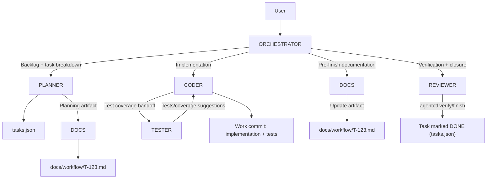
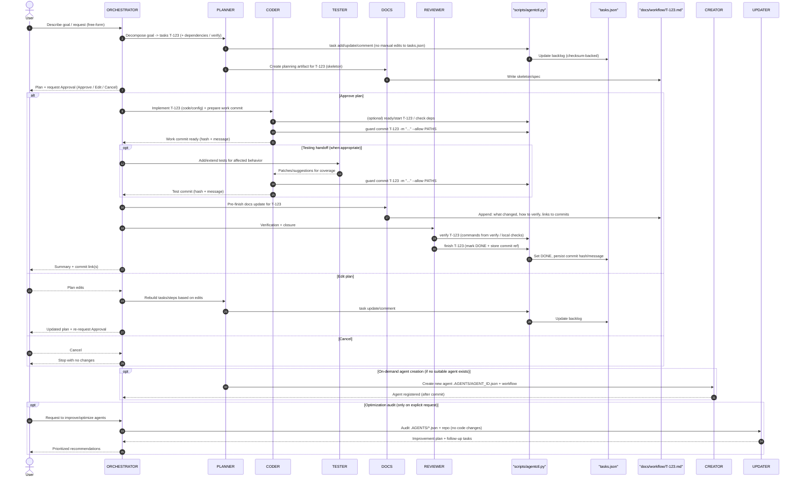

# Codex Swarm


Codex Swarm turns your local IDE + OpenAI Codex plugin into a predictable multi-agent workflow. It fixes the “just chat with the model” chaos by adding a small, opinionated layer: JSON-defined agents, a shared task board, and commit rules so every change is planned and traceable. There is no separate runner or daemon—everything lives in this repo and flows through the plugin you already use. It’s tighter than “ChatGPT + my IDE” because the orchestrator plans, delegates, and keeps docs/tasks in sync instead of leaving breadcrumbs in a chat log.

## Getting Started

Prerequisites:
- OpenAI Codex plugin (Cursor / VS Code / JetBrains) configured for your repo
- Git and Python 3.10+ installed locally

1. Clone the repo:
   git clone https://github.com/basilisk-labs/codex-swarm.git
   cd codex-swarm

2. Open this folder in your IDE with the OpenAI Codex plugin enabled.

3. Start with the ORCHESTRATOR:
   - Describe a goal (e.g. “Add a new agent that keeps CHANGELOG.md in sync”).
   - The ORCHESTRATOR will propose a plan, map steps to PLANNER/CODER/REVIEWER/DOCS and ask for approval.

4. Task tracking:
   - `tasks.json` is the single source of truth.
   - Use `python scripts/agentctl.py task list` / `python scripts/agentctl.py task show T-123` to inspect tasks.
   - Use `python scripts/agentctl.py task lint` to validate schema/deps/checksum (manual edits are not allowed).

5. Optional (recommended for a clean slate):
   - Run `./clean.sh` to remove the bundled project files, reinitialize the git repo, and reuse the framework for any tasks you want to orchestrate locally.

## Example: auto-doc for a tiny refactor

1. User: “Refactor utils/date.ts and update the README accordingly.”
2. ORCHESTRATOR: proposes a 2-step plan (PLANNER creates tasks; CODER implements and commits).
3. PLANNER: creates T-041 (refactor) and T-042 (docs) and sets them to DOING.
4. CODER: edits `utils/date.ts`, updates `README.md`, runs any checks, and commits with an emoji message like “🔧 T-041 refactor date utils”.
5. REVIEWER: verifies the diff, adds a short review comment, and marks T-041 done.
6. DOCS (optional): updates docs for T-042 and marks it done.

## Limitations / Non-goals

- Codex Swarm is a prompt + JSON framework that assumes the OpenAI Codex plugin as the runtime; there is no standalone agent runner yet.
- All file operations happen in your local repo; the model only sees what the plugin sends from the IDE session.
- It is designed for orchestrated, human-in-the-loop workflows—not autonomous deployments or remote execution.
- Network calls or external tooling only happen when you explicitly run them from your IDE; the framework itself does not fetch data on its own.

## ✨ Highlights

- 🧠 **Orchestrated specialists:** Every agent prompt lives in `.AGENTS/*.json` so the orchestrator can load roles, permissions, and workflows dynamically.
- 🧭 **Workflow guardrails:** The global instructions in `AGENTS.md` enforce approvals, planning, and emoji-prefixed commits so collaboration stays predictable.
- 📝 **Docs-first cadence:** `tasks.json` drives the backlog, and `python scripts/agentctl.py` provides a safe CLI for inspecting/updating tasks (checksum-backed, no manual edits).
- 🧪 **Post-change test coverage:** Development work can hand off to TESTER so relevant behavior is protected by automated tests before moving on.

## 🚀 How It Works

1. 🧭 **Orchestrator-focused contract.** `AGENTS.md` defines only the global rules, shared state, and the ORCHESTRATOR agent. The orchestrator interprets the user’s goal, drafts a plan, requests approval, and delegates work to other agents.
2. 📦 **External agent registry.** Every non-orchestrator agent lives in `.AGENTS/<ID>.json`. When the IDE loads this repository, it dynamically imports each JSON document and registers the agent ID, role, permissions, and workflow.
3. 📑 **Shared task state.** All task data lives in the root-level `tasks.json`, and `scripts/agentctl.py` is the only supported way to inspect/update it (checksum-valid, with readiness + verify gates).
4. 🧰 **Plugin-agnostic operation.** Because the instructions are plain Markdown and JSON, any IDE that supports the Codex Plugin can execute the same flows without extra configuration.
5. 🎯 **Optimization audits (optional):** When the user explicitly asks for agent improvements, the orchestrator triggers `@.AGENTS/UPDATER.json` so it can inspect `.AGENTS/*.json` and the rest of the repo before outlining targeted follow-up tasks.
6. 🧪 **Testing handoff (optional):** After CODER finishes an implementation, TESTER can add automated coverage for the touched behavior before REVIEWER finalizes the task.

## 🗂️ Repository Layout

```
.
├── AGENTS.md
├── LICENSE
├── README.md
├── tasks.json
├── scripts
│   └── agentctl.py
└── .AGENTS/
    ├── PLANNER.json
    ├── CODER.json
    ├── TESTER.json
    ├── REVIEWER.json
    ├── DOCS.json
    ├── CREATOR.json
    └── UPDATER.json
```

| Path | Purpose |
| --- | --- |
| `AGENTS.md` | 🌐 Global rules, commit workflow, and the ORCHESTRATOR specification (plus the JSON template for new agents). |
| `.AGENTS/PLANNER.json` | 🗒️ Defines how tasks are added/updated via `python scripts/agentctl.py` and kept aligned with each plan. |
| `.AGENTS/CODER.json` | 🔧 Implementation specialist responsible for code or config edits tied to task IDs. |
| `.AGENTS/TESTER.json` | 🧪 Adds or extends automated tests for the relevant code changes after implementation. |
| `.AGENTS/REVIEWER.json` | 👀 Performs reviews, runs `verify` commands, and finishes tasks via `python scripts/agentctl.py finish`. |
| `.AGENTS/DOCS.json` | 🧾 Writes per-task workflow artifacts under `docs/workflow/` and keeps docs synchronized. |
| `.AGENTS/CREATOR.json` | 🏗️ On-demand agent factory that writes new JSON agents plus registry updates. |
| `.AGENTS/UPDATER.json` | 🔍 Audits the repo and `.AGENTS` prompts when explicitly requested to outline concrete optimization opportunities and follow-up tasks. |
| `tasks.json` | 📊 Canonical backlog (checksum-backed). Do not edit by hand; use `python scripts/agentctl.py`. |
| `scripts/agentctl.py` | 🧰 Workflow helper for task ops (ready/start/block/task/verify/guard/finish) + tasks.json lint/checksum enforcement. |
| `README.md` | 📚 High-level overview and onboarding material for the repository. |
| `LICENSE` | 📝 MIT License for the project. |
| `assets/` | 🖼️ Contains the header image shown on this README and any future static visuals. |
| `clean.sh` | 🧹 Cleans the repository copy and restarts `git` so you can reuse the snapshot as your own local project. |

## 🧬 Agent Lifecycle

1. 🗺️ **Planning:** The ORCHESTRATOR reads `AGENTS.md`, loads `.AGENTS/*.json`, and creates a plan that maps each step to a registered agent (e.g., PLANNER, CODER, REVIEWER, DOCS).
2. ✅ **Approval:** The user can approve, edit, or cancel the plan before any work starts.
3. 🛠️ **Execution:** The orchestrator switches `agent_mode` according to the plan, allowing each agent to follow its JSON-defined workflow inside the IDE.
4. 📈 **Progress tracking:** Agents use `python scripts/agentctl.py` to inspect/update tasks (ready/start/block/task show/list/verify/finish) so `tasks.json` stays checksum-valid.
5. 🎯 **Optimization audits (optional):** When the user explicitly asks for agent improvements, the orchestrator triggers `@.AGENTS/UPDATER.json` so it can inspect `.AGENTS/*.json` and propose targeted follow-up tasks.

This structure lets you string together arbitrary workflows such as code implementation, documentation refreshes, research digests, or task triage—all from the same IDE session.

## 🔁 Default Agent Flow (Mermaid)

The typical development workflow is: plan the task, implement it, add test coverage, document the outcome, then verify + close.



## 🧬 Detailed Agent Sequence (Mermaid)



## 🧾 Commit Workflow

- The workspace is always a git repository, so every meaningful change must land in version control.
- Default to a minimal 3-phase commit cadence per task:
  - Planning: `tasks.json` + initial `docs/workflow/T-###.md` artifact.
  - Implementation: the actual change set (preferably including tests) as a single work commit.
  - Verification/closure: run checks, update `docs/workflow/T-###.md`, and mark the task `DONE` in `tasks.json`.
- The agent that performs the work stages and commits before handing control back to the orchestrator, briefly describing the completed plan item so the summary is obvious, and the orchestrator pauses the plan until that commit exists.
- Step summaries mention the new commit hash and confirm the working tree is clean so humans can audit progress directly from the conversation.
- If a plan step produces no file changes, call that out explicitly; otherwise the swarm must not proceed without a commit.
- Avoid extra commits that only move status fields (e.g., standalone “start/DOING” commits) unless truly necessary.

## 📚 Shared State Details

- **`tasks.json`**: Canonical backlog file containing every task’s ID, title, description, status, priority, owner, tags, and threaded comments; completed entries now also store a `commit` object (hash + message) so every “Done” task points back to the git change that closed it.
- **`scripts/agentctl.py`**: Workflow helper that enforces safe `tasks.json` updates (checksum + schema), dependency readiness checks, per-task verification hooks, and git commit guardrails.

## 🆕 Adding a New Agent

1. Duplicate the template defined in `AGENTS.md` under “JSON Template for New Agents”.
2. Save the file as `.AGENTS/<AGENT_ID>.json` using an uppercase ID (e.g., `RESEARCHER.json`).
3. Fill in the `role`, `description`, `inputs`, `outputs`, `permissions`, and ordered `workflow` steps that describe exactly how the agent should behave.
4. Commit the file; on the next run the orchestrator will automatically load and expose the new agent.

Because every agent is pure JSON, you can extend the swarm with domain experts for QA, marketing, technical writing, data wrangling, or any other process you want to automate in your IDE.

## 🌍 Extending Beyond Development

While Codex Swarm is comfortable implementing code, nothing restricts agents to development tasks. By defining workflows in JSON you can build:

- 🧪 Research agents that summarize documentation before coding begins.
- 🛡️ Compliance reviewers that check commits for policy violations.
- ⚙️ Operational runbooks that coordinate deployments or incident response.
- 📓 Documentation bots that keep changelogs and README updates synchronized.

If the OpenAI Codex Plugin can access the repository from your IDE, it can orchestrate these agents using the same framework.

## 🧩 Code breakdown

- **`assets/`** stores static media like `assets/header.png` so the README and any future docs can ship branded visuals without adding tooling.
- **`.AGENTS/*.json`** contains every specialist prompt, permissions, and workflow so the orchestrator can register new agents simply by dropping another JSON file.
- **`tasks.json`** tracks the backlog, while `scripts/agentctl.py` provides the supported CLI for inspecting and updating tasks without breaking the checksum.
- **`CONTRIBUTING.md`** and `README.md` are the primary guides for contributors; `LICENSE` keeps the MIT terms inside the repo’s root.
- **`clean.sh`** removes the existing `git` history, README, task state, and assets before running `git init`, giving you a blank slate after downloading the repo zip.

## 🛠️ Local development

1. Install a fresh snapshot from GitHub via shell command (e.g., `curl -fsSL https://codexswarm.xyz/install.sh | bash`), and `cd` into the extracted folder.
2. Run `./clean.sh` to delete the bundled assets, documentation, and git metadata and to reinitialize the repository; this step makes the workspace yours without lingering ties to the original repo.
3. After `clean.sh` finishes, add back the files you plan to edit (e.g., copy `AGENTS.md`, `.AGENTS`, etc.) and use `python scripts/agentctl.py task lint` after any task changes to keep `tasks.json` checksum-valid.
4. Use the ORCHESTRATOR workflow described above to plan work, update tasks via `python scripts/agentctl.py`, and commit each atomic task with an emoji-prefixed message.
